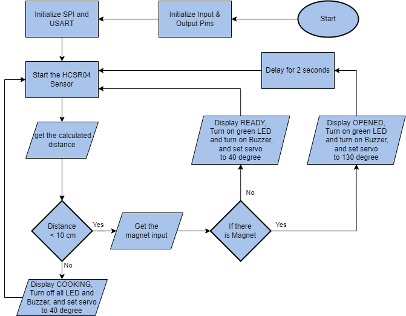

# Automatic Waiter Caller for Chef
## Introduction to the problem and the solution

In the restaurant industry, efficient communication between chefs and waiters is crucial for delivering a seamless dining experience. However, there is often a challenge in conveying the readiness of food to the waitstaff, resulting in delays or miscommunication. To address this problem, we propose the Automatic Waiter Caller for Chef system. This system aims to provide a solution by incorporating sensors and visual indicators to notify waiters when the food is ready to be served.

## Hardware design and implementation details

The hardware design of the Automatic Waiter Caller for Chef system involves several components. The HC SR04 sensor is positioned near the food, detecting its presence and readiness. A Hall effect sensor is placed on the waiter's side, allowing them to trigger the system. The system incorporates a servo mechanism to control the opening and closing of a separating glass. An LED and a buzzer are used to provide visual and audible cues to the waiter. Additionally, a MAX7219 display is included to show the status of the food, such as "Cooking," "Ready," or "Opened."

To implement the hardware design, the HC SR04 sensor is connected to the appropriate Arduino pins, and the Hall effect sensor is similarly connected. The LED and buzzer are connected to output pins to enable visual and auditory notifications. The servo is connected to the Arduino board to control the opening and closing of the separating glass. The MAX7219 display is connected to the Arduino, and the necessary communication protocol is established.

## Software implementation details

The software implementation of the Automatic Waiter Caller for Chef system involves coding the necessary functionalities. A microcontroller is programmed to process the input from the HC SR04 sensor, triggering the appropriate output signals. When the food is detected, the LED illuminates, and the buzzer sounds to call the waiter. The microcontroller also handles the interaction with the Hall effect sensor, initiating the opening of the separating glass using the servo mechanism. A delay is implemented to provide the waiter sufficient time to reach the food before the glass opens. The MAX7219 display is controlled by the microcontroller to show relevant food status information.
The flowchart for the software as such:

## Test results and performance evaluation

To evaluate the system's performance and validate its functionality, testing was conducted using various scenarios. The following tests were performed:

1. Food Detection Test: The HC SR04 sensor accurately detected the presence of food in real-time. The system consistently recognized the food's availability and initiated the appropriate actions.

2. Hall Effect Sensor Test: The Hall effect sensor responded promptly to the waiters's trigger, indicating that the separating glass was opened and the food is taken. This ensured efficient coordination between the kitchen and the waiter.

3. LED and Buzzer Activation Test: The LED and buzzer provided immediate visual and auditory cues to alert the waiter. These signals were found to be highly noticeable, ensuring quick responses from the waitstaff.

4. Servo Operation Test: The servo successfully opened the separating glass, allowing easy access to the food once it was ready. The servo mechanism operated smoothly and reliably throughout the testing phase.

5. MAX7219 Display Test: The MAX7219 display accurately presented the food's status, displaying "Cooking," "Ready," or "Opened" as expected. The display provided clear and concise information, aiding the waiter in managing food service effectively.

The test results demonstrated that the system consistently performed as intended, successfully notifying the waiter when the food was ready and facilitating timely service. The system performed reliably, ensuring efficient communication between the kitchen and the waiter, resulting in improved food service and customer satisfaction.

## Conclusion and future work

In conclusion, the Automatic Waiter Caller for Chef system has proven to be a valuable solution for enhancing communication between chefs and waiters in a restaurant setting. By incorporating sensors, LED indicators, and a servo motor, the system ensures efficient coordination and prompt serving of food. The successful implementation of the system demonstrates its potential to streamline restaurant operations and improve customer satisfaction.

Future work for the Automatic Waiter Caller for Chef system could involve further optimization and refinement of the hardware and software components. This includes exploring additional features such as integrating wireless communication between the chef and waiter, implementing machine learning algorithms to predict food readiness, or incorporating a user-friendly interface for easy configuration. These enhancements would further elevate the system's capabilities and contribute to the advancement of restaurant automation technology.
